# 工程介绍

构建一个带路由功能的HTTP微服务架构，支持`JSON`序列化，支持`MySQL`关系型数据库，支持`JWT`安全认证，支持`Nacos`服务注册与配置管理，支持消息中间件`RocketMQ`，支持`FastDFS`分布式文件存储，支持`Redis`缓存数据库，支持`Excel`报表导入导出。

## 1 目录说明

- `arch-demo`：架构演示模块
- `lib-dy`：动态库存放目录
- `lib-common`：公用组件静态库模块
- `lib-oatpp`：web服务组件静态库模块
- `lib-mysql`：mysql数据库组件静态模块
- `.gitattributes`：git属性配置文件
- `.gitignore`：git忽略配置文件
- `build.sh`：Linux环境下构建和安装脚本
- `run-xxx.sh`：Linux环境下服务启动脚本
- `CMakeLists.txt`：`cmake`配置
- `CMakeSettings.json`：`cmake`项目配置文件
- `copy-resources.bat`：快速构建项目模块批处理脚本
- `exclude.txt`：批处理复制排除项配置
- `ProjCpp.sln`：解决方案配置
- `imgs`：自述文件图片资源目录
- `README.md`：工程自述文件

## 2 静态库目录规范

静态库项目包括如下几个主要的目录结构：

- `include`：存放第三方引入库的`h`或`hpp`文件，存放自己编写的`h`文件，方便使用静态库引用。
- `src`：存放`include`定义`h`的实现`cpp`资源文件。
- `lib / lib64`：用于存放第三方库编译的静态库。
- `pch.h / pch.cpp`：如果需要预编译标头，那么就需要定义。

## 3 动态库目录规范

动态库目录名称为`lib-dy`，里面主要包含程序执行需要的动态库文件，按照如下目录结构存放文件即可。

- `lib`
  - debug
  - release
- `lib64`
  - debug
  - release
  - Linux系统下面用到的动态库

## 4 环境搭建参考
静态库：

https://docs.microsoft.com/zh-cn/cpp/build/walkthrough-creating-and-using-a-static-library-cpp?view=msvc-160

标头：

https://docs.microsoft.com/zh-cn/cpp/build/walkthrough-header-units?view=msvc-160

**Linux：**

- https://docs.microsoft.com/zh-cn/cpp/linux/download-install-and-setup-the-linux-development-workload?view=msvc-160

- ```sh
  # CentOS、龙蜥
  yum -y install openssh-server gcc-c++ gdb cmake make ninja-build rsync zip unzip
  # Ubuntu
  sudo apt-get -y install openssh-server g++ gdb cmake make ninja-build rsync zip unzip
  ```

## 5 Windows平台项目搭建

克隆项目架构后，可以先使用`arch-demo`项目进行测试，用于确认项目架构能否正常工作。

**TIP：** 

*如果在运行 `demo` 的时候出现找不到 `dll`文件错误，那么参考 **5.1.8.2** 对 `demo`的项目配置进行修改即可。*

接下来就需要在解决方案中，新增项目来完成你自己的业务功能。

创建完项目后可以使用`copy-resources.bat`工具复制`demo`中的架构骨架代码到你的项目中。

新建项目中需要引入`lib-oatpp`、`lib-mysql`、`lib-common`静态库以及对项目属性进行相应的配置。

接下我们来看看如何配置你的项目属性和编写关键代码。

***TIP：后续如果要想导入其他静态库，也可以参考下面的流程来完成。***

*如果在项目完成设置后，依然不能正常工作，可以对比`arch-demo`的配置进行修正。*

### 5.1 项目属性设置

#### 5.1.1 引用模块

操作路径：项目右键->添加->引用，然后选择下图所示的模块。

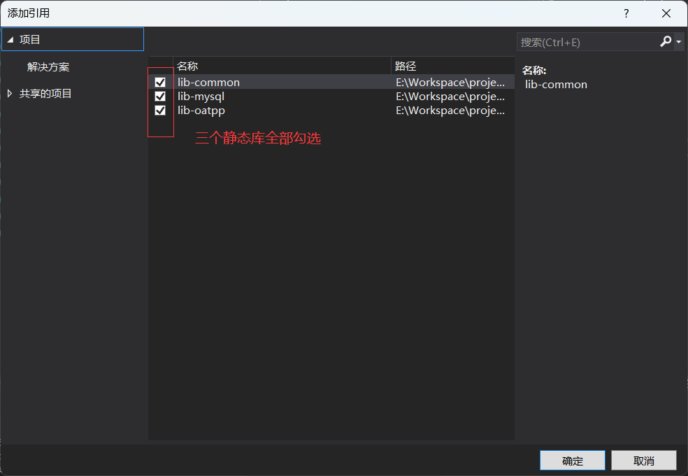

#### 5.1.2 附加库目录

操作步骤示意图：

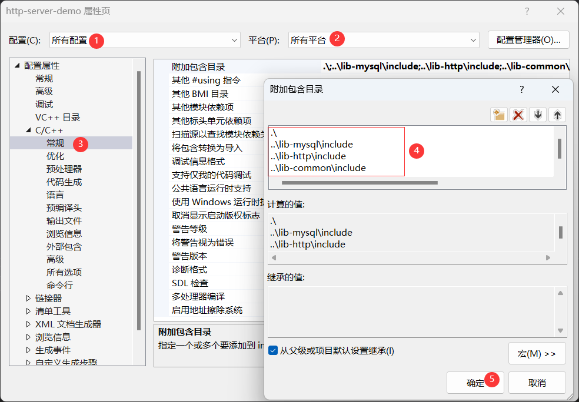

包含库目录内容如下：

```
.\
..\lib-mysql\include
..\lib-oatpp\include
..\lib-common\include
```

#### 5.1.3 预编译头

设置使用预编译头，示意步骤如下图

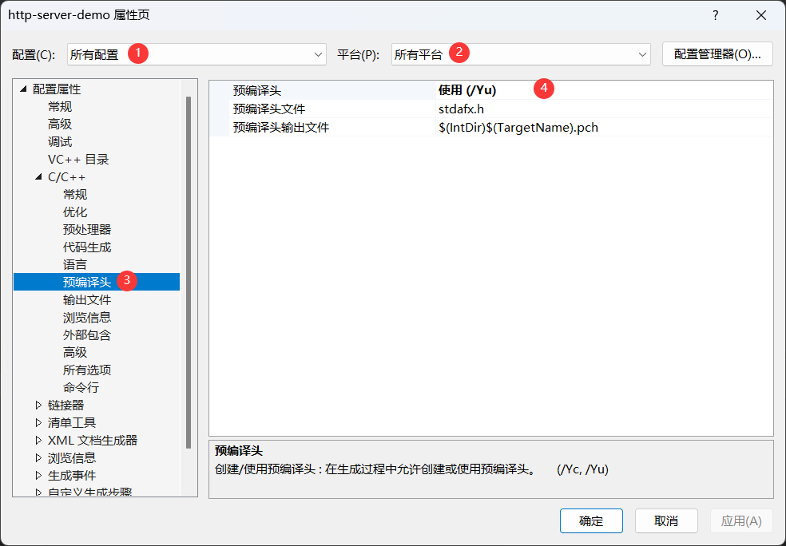

下面是`stdafx.h`

```c++
// stdafx.h: 这是预编译标头文件。
// 下方列出的文件仅编译一次，提高了将来生成的生成性能。
// 这还将影响 IntelliSense 性能，包括代码完成和许多代码浏览功能。
// 但是，如果此处列出的文件中的任何一个在生成之间有更新，它们全部都将被重新编译。
// 请勿在此处添加要频繁更新的文件，这将使得性能优势无效。

#ifndef STDAFX_H
#define STDAFX_H

#ifndef LINUX

// 解决std::byte类型重定义
#define _HAS_STD_BYTE 0
// 添加要在此处预编译的标头
#include "OatppMacros.h"
#include "jwt/jwt.hpp"
#include "mysql/jdbc.h"
#include "SqlSession.h"
#include "yaml-cpp/yaml.h"
#include "sw/redis++/redis++.h"

#endif // !LINUX

#endif //STDAFX_H
```

下面是`stdafx.cpp`

```c++
// stdafx.cpp: 与预编译标头对应的源文件

#include "stdafx.h"

// 当使用预编译的头时，需要使用此源文件，编译才能成功。
```

***注意：`stdafx.cpp`文件属性需要重新设置***

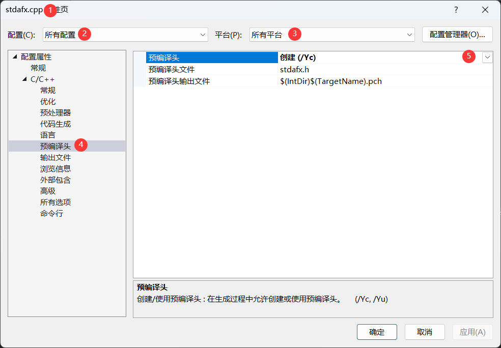

***注意：后面实现的  `cpp`  文件都需要在开头引入  `stdafx.h`***

#### 5.1.4 链接器——常规

##### 5.1.4.1 `Win32`平台

`Win32-Debug`配置操作步骤如下图所示

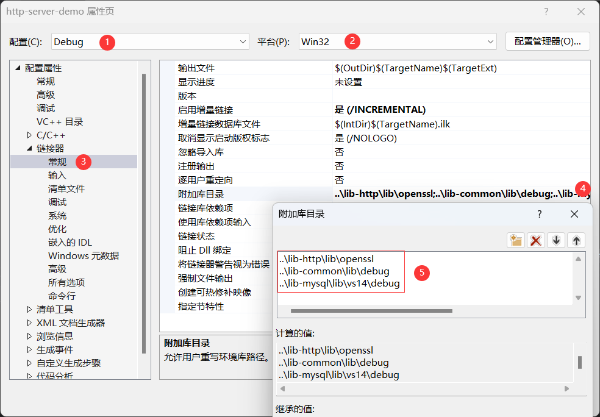

附加库目录内容如下：

```
..\lib-oatpp\lib\openssl
..\lib-oatpp\lib\debug
..\lib-common\lib\debug
..\lib-mysql\lib\vs14\debug
```

`Win32-Release`配置操作步骤如下图所示

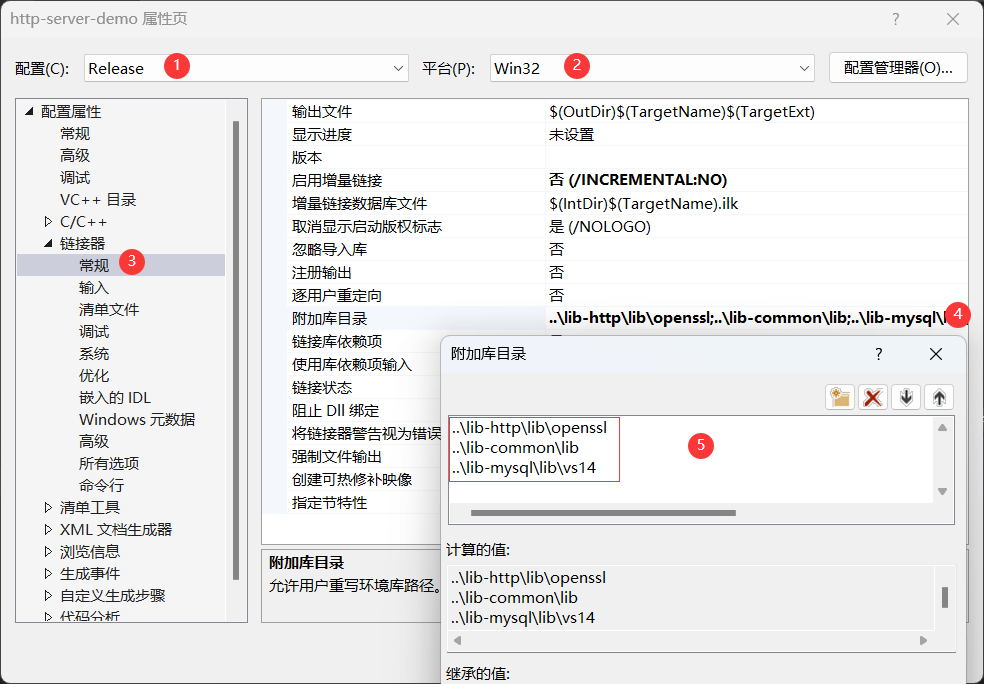

附加库目录内容如下：

```
..\lib-oatpp\lib\openssl
..\lib-oatpp\lib
..\lib-common\lib
..\lib-mysql\lib\vs14
```

##### 5.1.4.2 `x64`平台

`x64-Debug`配置操作步骤如下图所示

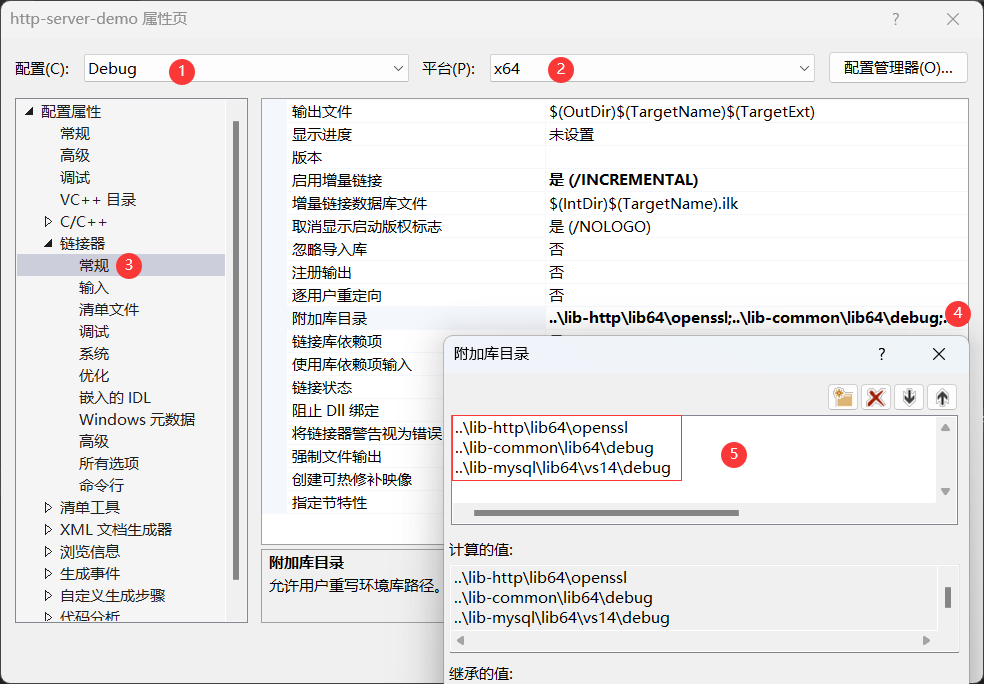

附加库目录内容如下：

```
..\lib-oatpp\lib64\openssl
..\lib-oatpp\lib64\debug
..\lib-common\lib64\debug
..\lib-mysql\lib64\vs14\debug
```

`x64-Release`配置操作步骤如下图所示

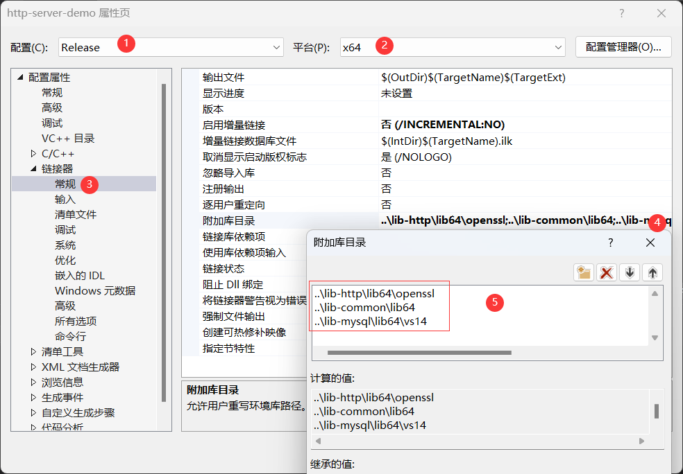

附加库目录内容如下：

```
..\lib-oatpp\lib64\openssl
..\lib-oatpp\lib64
..\lib-common\lib64
..\lib-mysql\lib64\vs14
```

#### 5.1.5 链接器——输入

##### 5.1.5.1 Debug模式

配置操作步骤如下图所示

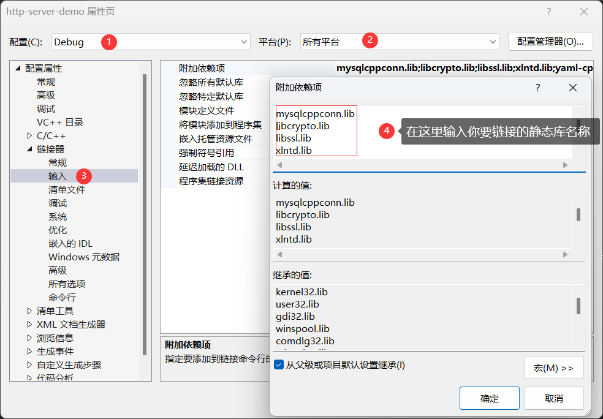

静态库内容如下：

```sh
# 必选库
oatpp.lib
oatpp-swagger.lib
ws2_32.lib
mysqlcppconn.lib
libcrypto.lib
libssl.lib
# 下面是可选库，如果需要对应功能再选择
# excel库
xlntd.lib
# yaml配置解析库
yaml-cppd.lib
# redis库
hiredis.lib
redis++.lib
# rocket消息中间件库
rocketmq-client-cpp.lib
# mongodb库
mongocxx.lib
bsoncxx.lib
# oatpp websocket
oatpp-websocket.lib
```

##### 5.1.5.2 Release模式

配置操作步骤如下图所示

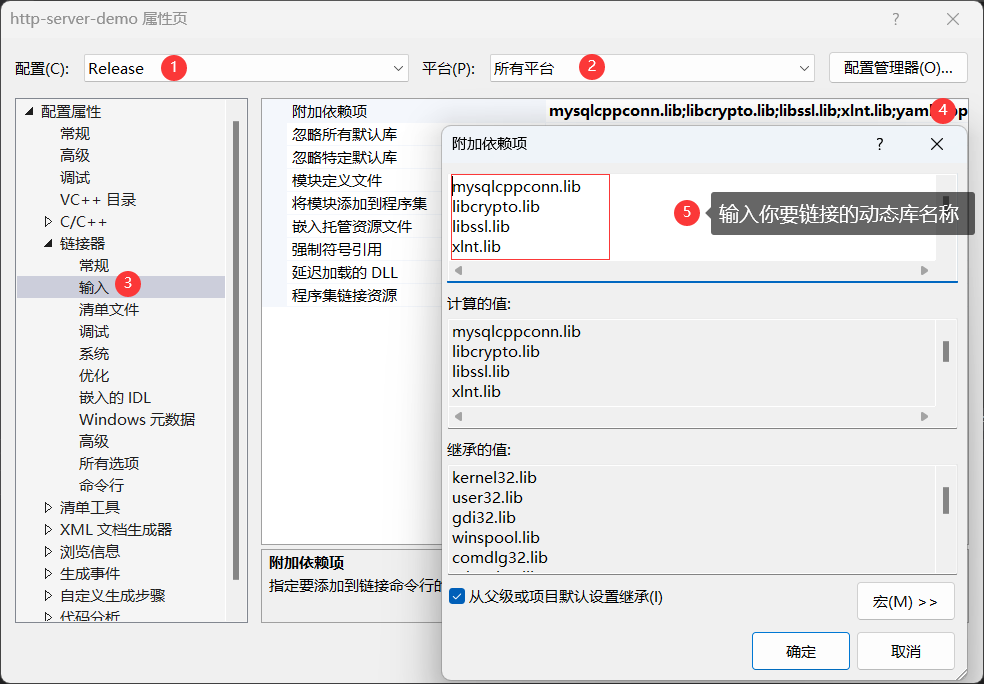

静态库内容如下：

```sh
# 必选库
oatpp.lib
oatpp-swagger.lib
ws2_32.lib
mysqlcppconn.lib
libcrypto.lib
libssl.lib
# 下面是可选库，如果需要对应功能再选择
# excel库
xlnt.lib
# yaml配置解析库
yaml-cpp.lib
# redis库
hiredis.lib
redis++.lib
# rocket消息中间件库
rocketmq-client-cpp.lib
# mongodb库
mongocxx.lib
bsoncxx.lib
# oatpp websocket
oatpp-websocket.lib
```

#### 5.1.6 链接器——优化

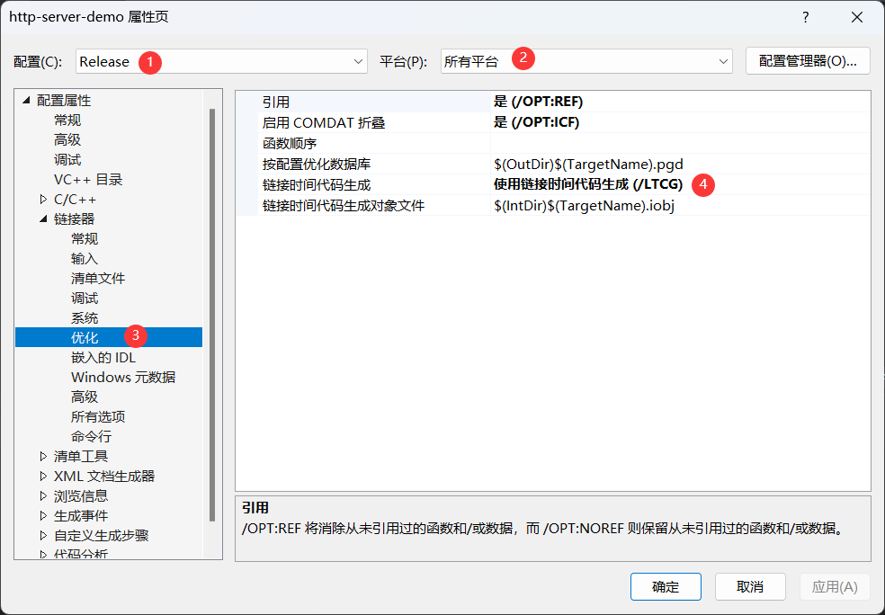

#### 5.1.7 设置语言版本

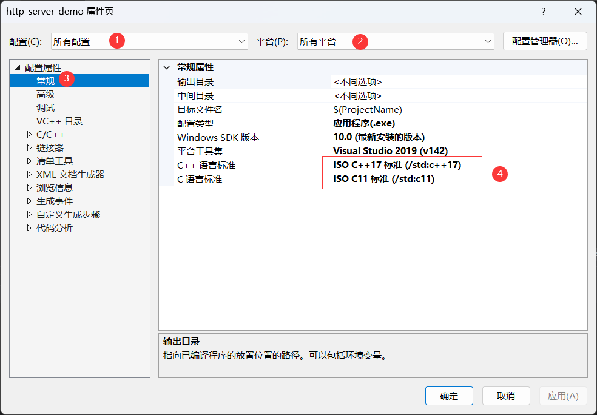

#### 5.1.8 设置动态链接库路径

##### 5.1.8.1 Release模式

Release模式下是进行`dll`文件复制，下面是复制指令：

```sh
# win32
xcopy "$(SolutionDir)lib-dy/lib/release" "$(OutDir)" /a /F /I /Y /C
# x64
xcopy "$(SolutionDir)lib-dy/lib64/release" "$(OutDir)" /a /F /I /Y /C
```

`Win32`平台

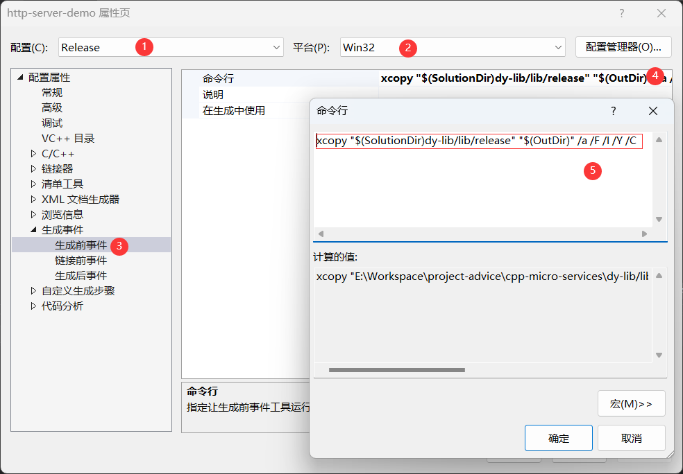

`x64`平台

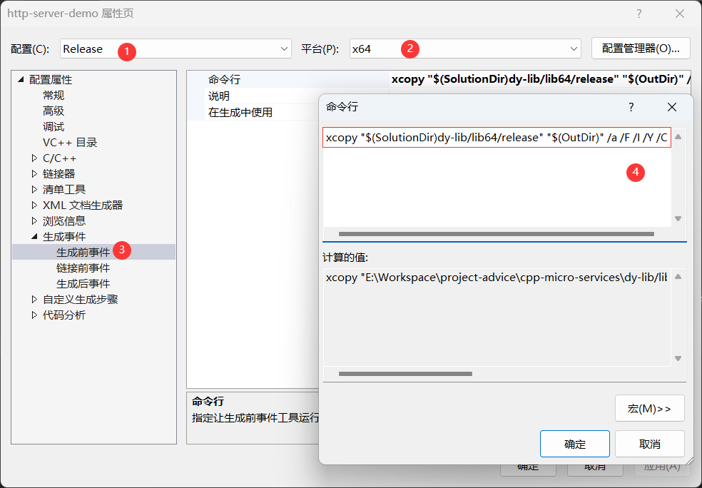

##### 5.1.8.2 Debug模式

Debug模式下为了加快启动效率，使用添加环境变量的方式。

***注意：***

***1.环境变量配置方式属于用户级配置，clone项目的每个客户端都需要再配置一次。***

***2.环境变量配置方式可能和系统中有的动态库冲突，如果冲突那么请手动复制 `dll` 到 `exe` 同级目录。***

下面是设置环境变量参考值：

```sh
# win32
path=%path%;../lib-dy/lib/debug
# x64
path=%path%;../lib-dy/lib64/debug
```

`Win32`平台

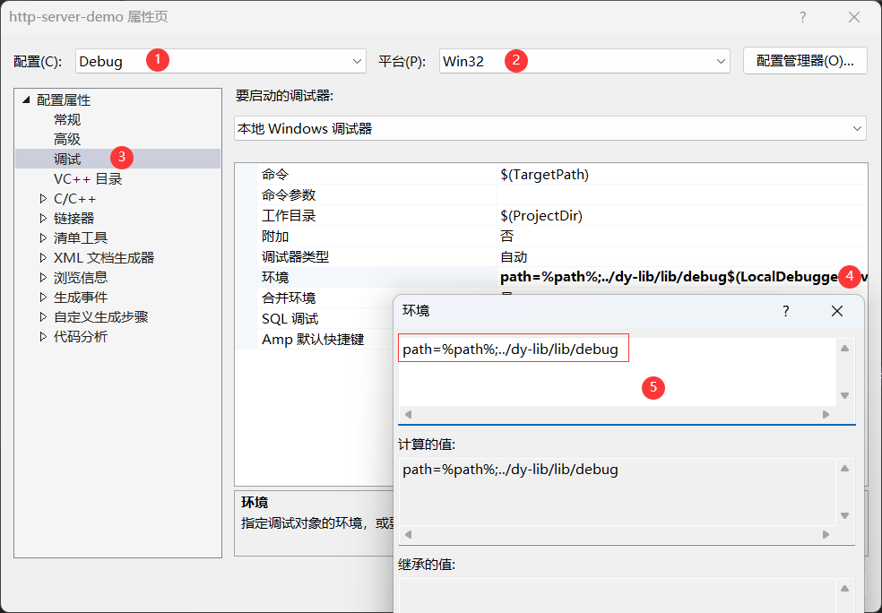

`x64`平台

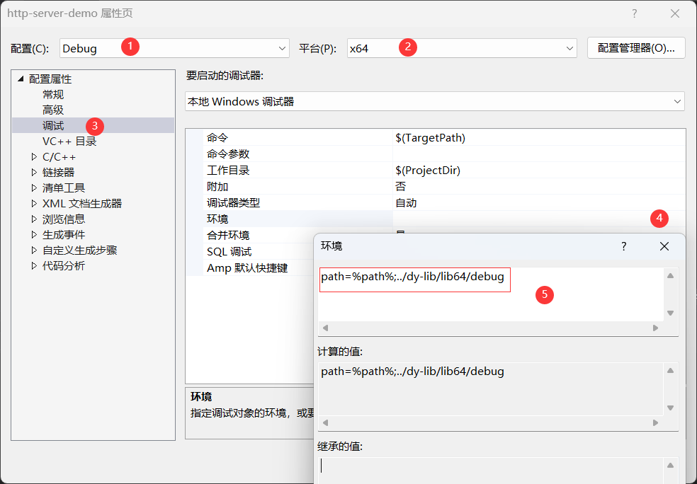

### 5.2 关键代码

#### 5.2.1 程序入口

`main.cpp`中可以使用下列代码来启动服务器。

```c++
#include "stdafx.h"
#include "HttpServer.h"
#include "DbInit.h"

int main() {
    //初始数据库连接
    DbInit::initDbPool(
        DBConfig("root", "123456", "test", "192.168.220.128", 3306, 25));
    // 启动HTTP服务器
	HttpServer::startServer("8090",
		[=](Endpoints* doc, HttpRouter* router) {
			//设置路由，可以参考Router的实现
		});
	//释放数据库连接
	DbInit::releasePool();
	return code;
}
```

#### 5.2.2 实现拦截器

在`lib-oatpp` 模块定义一个拦截器（`SystemInterceptor.h`）需要在引用模块来实现。

```c++
#include "stdafx.h"
#include "SystemInterceptor.h"
using namespace oatpp::web::protocol::http;
using namespace oatpp::web::protocol::http::outgoing;
// 实现跨域请求拦截
std::shared_ptr<oatpp::web::server::interceptor::RequestInterceptor::OutgoingResponse> CrosRequestInterceptor::intercept(const std::shared_ptr<IncomingRequest>& request)
{
	return nullptr;
}
// 实现跨域响应拦截
std::shared_ptr<oatpp::web::server::interceptor::ResponseInterceptor::OutgoingResponse> CrosResponseInterceptor::intercept(const std::shared_ptr<IncomingRequest>& request, const std::shared_ptr<OutgoingResponse>& response)
{
	return response;
}
// 凭证检测拦截器构造初始化一些内容
CheckRequestInterceptor::CheckRequestInterceptor(const std::shared_ptr<oatpp::data::mapping::ObjectMapper>& objectMapper)
{
}
// 实现凭证检测拦截处理逻辑
std::shared_ptr<oatpp::web::server::interceptor::RequestInterceptor::OutgoingResponse> CheckRequestInterceptor::intercept(const std::shared_ptr<IncomingRequest>& request)
{
	return nullptr;
}
```

***TIP:完整的拦截器实现可以参考demo中实现，其中实现了凭证验证功能，可以直接复用。***

#### 5.2.3 使用启动参数

定义一个服务器信息类，用于存储服务器信息，参考代码如下

```cpp
class ServerInfo
{
private:
	// 成员初始化
	void init() {
		this->dbPort = 3306;
		this->dbMax = 25;
		// 加载中文词典
		zhDictNode = YAML::LoadFile("zh-dict.yaml");
	}
	// 定义单例
	DECLARE_INSTANCE(ServerInfo);
	// 服务器端口
	CC_SYNTHESIZE(std::string, serverPort, ServerPort);
	// Nacos配置参数
	CC_SYNTHESIZE(std::string, nacosAddr, NacosAddr);
	CC_SYNTHESIZE(std::string, nacosNs, NacosNs);
	CC_SYNTHESIZE(std::string, regIp, RegIp);
	CC_SYNTHESIZE(std::string, serviceName, ServiceName);
	// 数据库连接信息
	CC_SYNTHESIZE(std::string, dbUsername, DbUsername);
	CC_SYNTHESIZE(std::string, dbPassword, DbPassword);
	CC_SYNTHESIZE(std::string, dbName, DbName);
	CC_SYNTHESIZE(std::string, dbHost, DbHost);
	CC_SYNTHESIZE(int, dbPort, DbPort);
	CC_SYNTHESIZE(int, dbMax, DbMax);
	// 定义一个中文字典缓存
	CC_SYNTHESIZE_CR_GET(YAML::Node, zhDictNode, ZhDictNode);
};
```

通过启动参数设定服务器，方便部署服务器。

```c++
#include "stdafx.h"
#include "StringUtil.h"
#include "ServerInfo.h"
#include "HttpServer.h"
#include "controller/Router.h"
#include "DbInit.h"

/**
 * 解析启动参数
 * 注意：
 * 参数中数据需要满足一定的格式，如：sp=8090、sn=feign-cpp-sample
 * 前缀与真实值之间使用=分隔
 */
bool getStartArg(int argc, char* argv[]) {
	// 服务器端口
	std::string serverPort = "8090";
	// 数据库连接信息
	std::string dbUsername = "root";
	std::string dbPassword = "123456";
	std::string dbName = "test";
	std::string dbHost = "192.168.220.128";
	int dbPort = 3306;
	int dbMax = 25;
    
	// 开始解析
	int currIndex = 1;
	bool isSetDb = false;
	while (currIndex < argc)
	{
		// 拆分字符串
		auto args = StringUtil::split(argv[currIndex], "=");
		// 判断参数是否合法
		if (args.size() != 2) {
			cout << "arg: " << argv[currIndex] << ", format error." << endl;
			exit(1);
		}

		// 根据参数前缀对不同属性赋值
		std::string prefix = args[0];
		std::string val = args[1];
		if (prefix == "sp") serverPort = val;
		else if (prefix == "du") {
			isSetDb = true;
			dbUsername = val;
		}
		else if (prefix == "dp") {
			isSetDb = true;
			dbPassword = val;
		}
		else if (prefix == "dn") {
			isSetDb = true;
			dbName = val;
		}
		else if (prefix == "dh") {
			isSetDb = true;
			dbHost = val;
		}
		else if (prefix == "dP") {
			isSetDb = true;
			dbPort = atoi(val.c_str());
		}
		else if (prefix == "dm") dbMax = atoi(val.c_str());
		// 更新索引
		currIndex++;
	}

	// 记录服务器配置到内存中方便使用
	ServerInfo::getInstance().setServerPort(serverPort);
	ServerInfo::getInstance().setDbUsername(dbUsername);
	ServerInfo::getInstance().setDbPassword(dbPassword);
	ServerInfo::getInstance().setDbName(dbName);
	ServerInfo::getInstance().setDbHost(dbHost);
	ServerInfo::getInstance().setDbPort(dbPort);
	ServerInfo::getInstance().setDbMax(dbMax);
	return isSetDb;
}

int main(int argc, char* argv[]) {
	// 服务器参数初始化
	bool isSetDb = getStartArg(argc, argv);
	// 初始数据库连接
	DbInit::initDbPool(DBConfig(
		ServerInfo::getInstance().getDbUsername(), 
		ServerInfo::getInstance().getDbPassword(), 
		ServerInfo::getInstance().getDbName(),
		ServerInfo::getInstance().getDbHost(),
		ServerInfo::getInstance().getDbPort(), 
		ServerInfo::getInstance().getDbMax()));
	// 启动HTTP服务器
	HttpServer::startServer(ServerInfo::getInstance().getServerPort(),
		[=](Endpoints* doc, HttpRouter* router) {
			Router(doc, router).initRouter();
		});
	// 释放数据库连接
	DbInit::releasePool();
	return code;
}
```

所有启动参数说明：

```sh
"na: nacos server host and port. example na=39.99.114.126:8848"
"ns: nacos server namespace. example ns=1653f775-4782-46ad-9cd2-b60155a574c6"
"ip: register ip. example ip=192.168.220.128"
"sn: register service name. example sn=feign-cpp-sample"
"sp: server port. example sp=8090"
"du: mysql database username. example du=root"
"dp: mysql database password. example dp=123456"
"dn: mysql database dbname. example dn=test"
"dh: mysql database host. example dh=192.168.220.128"
"dP: mysql database port. example dP=3306"
"dm: mysql database pool maxsize. example dm=25"
```

## 6 Linux平台项目搭建

### 6.1 参考链接

#### 6.1.1 `VS CMake`

VS中使用`CMake`参考下面的链接：

https://docs.microsoft.com/zh-cn/cpp/build/cmake-projects-in-visual-studio?view=msvc-170&viewFallbackFrom=vs-2019

除了完成 **小节4** 中Linux配置外，为了保证在编译时正常链接程序所需要的库，需要补充安装下列软件包：

```sh
# CentOS、龙蜥
yum -y install openssl-devel libcurl-devel
# Ubuntu
sudo apt-get -y install openssl libssl-dev libcurl4-openssl-dev
```

#### 6.1.2 `openssl`版本升级

当你启动编译后的可执行文件出现下面的错误，出现这个问题一般是在`CentOS7`上面

```sh
./arch-demo: error while loading shared libraries: libssl.so.1.1: cannot open shared object file: No such file or directory
```

可以参考这个链接进行修复：https://blog.csdn.net/estelle_belle/article/details/111181037

### 6.2 编译配置

#### 6.2.1 项目模块

你只需要在windows项目模块根目录书写一个`CMakeLists.txt`文件即可，下面是参考配置。

你可以复制一份demo里面的`CmakeLists.txt`文件到你的项目模块加以修改即可。

```cmake
# CMakeList.txt: arch-demo 的 CMake 项目，在此处包括源代码并定义
# 项目特定的逻辑。
#
cmake_minimum_required (VERSION 3.8)

# 【需要修改】：设置文件名称
set (appName arch-demo)

# 包含库目录
include_directories ("./")
include_directories ("../lib-oatpp/include")
include_directories ("../lib-mysql/include")
include_directories ("../lib-common/include")

# 链接库路径，程序运行的时候也在这里找
link_directories (${PROJECT_BINARY_DIR}/lib-oatpp)
link_directories (${PROJECT_BINARY_DIR}/lib-mysql)
link_directories (${PROJECT_BINARY_DIR}/lib-common)
link_directories (${PROJECT_SOURCE_DIR}/lib-common/lib64)
link_directories (${PROJECT_SOURCE_DIR}/lib-oatpp/lib64)
link_directories (${PROJECT_SOURCE_DIR}/lib-dy/lib64)

# 将源代码添加到此项目的可执行文件
file (GLOB_RECURSE SC_FILES ./*.cpp)

# 编译可执行文件
add_executable (${appName} ${SC_FILES})

# 链接库
target_link_libraries (${appName} "lib-common" "lib-oatpp" "lib-mysql")

# 链接其他库依赖库，如：你要链接libpthread直接写成pthread
target_link_libraries (${appName} pthread stdc++fs OpenSSL::SSL )
target_link_libraries (${appName} oatpp-websocket oatpp-swagger oatpp )
target_link_libraries (${appName} mysqlcppconn )
# 链接xlnt
if(USE_XLNT)
	target_link_libraries (${appName} xlnt )
	message (STATUS "${appName}: link xlnt lib")
endif()
# 链接fastdfs
if(USE_DFS)
	target_link_libraries (${appName} fdfsclient fastcommon )
	message (STATUS "${appName}: link fdfsclient lib")
endif()
# 链接ymal
if(USE_YML)
	target_link_libraries (${appName} yaml-cpp )
	message (STATUS "${appName}: link yamlcpp lib")
endif()
# 链接nacos
if(USE_NACOS)
	target_link_libraries (${appName} nacos-cli )
	message (STATUS "${appName}: link nacos lib")
endif()
# 链接redis
if(USE_REDIS)
	target_link_libraries (${appName} redis++ hiredis )
	message (STATUS "${appName}: link redis lib")
endif()
# 链接RocketMQ
if(USE_ROCKETMQ)
	target_link_libraries (${appName} rocketmq )
	message (STATUS "${appName}: link rocketmq lib")
endif()
# 链接MongoDB
if(USE_MONGO)
	target_link_libraries (${appName} bsoncxx bson-1.0 mongocxx mongoc-1.0 )
	message (STATUS "${appName}: link mongodb lib")
endif()

# 复制配置到调试时可执行文件所在的目录
# RSA公钥证书
file (COPY "public.pem" DESTINATION ${PROJECT_BINARY_DIR}/${appName})
# FastDFS配置文件
file (GLOB fdfsConf "../lib-common/include/fastdfs/conf/*")
file (COPY ${fdfsConf} DESTINATION ${PROJECT_BINARY_DIR}/${appName}/conf)
# Swagger资源
file (GLOB swaggerRes "../lib-oatpp/include/oatpp-swagger/res/*")
file (COPY ${swaggerRes} DESTINATION ${PROJECT_BINARY_DIR}/${appName}/res)
# 中文词典
file (COPY "zh-dict.yaml" DESTINATION ${PROJECT_BINARY_DIR}/${appName})
# 如果是Ubuntu系统,需要复制一下动态库
if(IS_UBUNTU)
	file (GLOB dylibdir "${PROJECT_SOURCE_DIR}/lib-dy/lib64/*")
    file (COPY ${dylibdir} DESTINATION "${PROJECT_BINARY_DIR}/${appName}")
endif()

# 安装文件
# 可执行文件
install (TARGETS ${appName} RUNTIME DESTINATION ${appName})
# RSA公钥证书
install (FILES "public.pem" DESTINATION ${appName})
# FastDFS配置文件
install (DIRECTORY "${PROJECT_SOURCE_DIR}/lib-common/include/fastdfs/conf" DESTINATION ${appName})
# Swagger资源
install (DIRECTORY "${PROJECT_SOURCE_DIR}/lib-oatpp/include/oatpp-swagger/res" DESTINATION ${appName})
# 中文词典
install (FILES "zh-dict.yaml" DESTINATION ${appName})
# 第三方动态链接库
install (DIRECTORY "${PROJECT_SOURCE_DIR}/lib-dy/lib64/" DESTINATION lib FILES_MATCHING PATTERN "*.so*")
# 启动脚本
install (PROGRAMS ${PROJECT_SOURCE_DIR}/run-front.sh ${PROJECT_SOURCE_DIR}/run-back.sh DESTINATION ${appName})
```

#### 6.2.2 全局配置

除此之外，还需要修改解决方案中的`CMakeLists.txt`，包含你的项目模块目录，参考如下：

```cmake
# CMakeList.txt: 顶层 CMake 项目文件，在此处执行全局配置
# 并包含子项目。
#
cmake_minimum_required (VERSION 3.8)

# 【需要修改】：指定工程名
project ("zero-one-star-cpp-proj")

# 设置安装目录前缀
set (CMAKE_INSTALL_PREFIX "../install/${PROJECT_NAME}" CACHE PATH "install path prefix" FORCE )

# C++标准
set (CMAKE_CXX_STANDARD 17)
set (CMAKE_CXX_STANDARD_REQUIRED ON)

# 添加宏定义
add_definitions(-DLINUX)
add_definitions(-D_CRT_SECURE_NO_WARNINGS -D_SILENCE_ALL_CXX17_DEPRECATION_WARNINGS)
add_definitions(-DCPP_JWT_USE_VENDORED_NLOHMANN_JSON)
add_definitions(-DOATPP_DISABLE_ENV_OBJECT_COUNTERS)
add_definitions(-DCHECK_TOKEN)
add_definitions(-DSTOP_PWD="01star")
add_definitions(-DOATPP_SWAGGER_SERVICE_NAME="arch demo for linux")
add_definitions(-DOATPP_SWAGGER_RES_PATH="res")
add_definitions(-DBSONCXX_STATIC -DMONGOCXX_STATIC -DENABLE_AUTOMATIC_INIT_AND_CLEANUP=OFF)

# 在camke .. 的时候会输出提示目录路径
message (STATUS "Prefix dir is ${CMAKE_INSTALL_PREFIX}")
message (STATUS "Binary dir is ${PROJECT_BINARY_DIR}")
message (STATUS "Source dir is ${PROJECT_SOURCE_DIR}")

# 判断是否是Ubuntu系统
option (IS_UBUNTU "is ubuntu" OFF)
cmake_host_system_information(RESULT PRETTY_NAME QUERY OS_VERSION)
if (${PRETTY_NAME} MATCHES "Ubuntu")
	option (IS_UBUNTU "is ubuntu" ON)
endif()

# 检查OpenSSL库是否存在
find_package (OpenSSL REQUIRED)
if (OPENSSL_FOUND)
  include_directories (${OPENSSL_INCLUDE_DIRS})
  message (STATUS "OpenSSL Found!")
endif()

# 设置宏定义开关
# 【需要修改】：根据你的需要选用组件
option (USE_XLNT "use xlnt" ON)
option (USE_DFS "use fastdfs" ON)
option (USE_YML "use yaml" ON)
option (USE_NACOS "use nacos, need open yaml" ON)
option (USE_REDIS "use redis" ON)
option (USE_ROCKETMQ "use rocketmq" ON)
option (USE_MONGO "use mongodb" ON)

# 选项宏定义
# 为了保证排除后编译通过，在单独使用这些库的地方加上对应的宏定义
if (USE_XLNT)
	add_definitions(-DUSE_XLNT)
endif()
if (USE_DFS)
	add_definitions(-DUSE_DFS)
endif()
if (USE_YML)
	add_definitions(-DUSE_YML)
endif()
if (USE_NACOS)
	add_definitions(-DUSE_NACOS)
endif()
if (USE_REDIS)
	add_definitions(-DUSE_REDIS)
endif()
if (USE_ROCKETMQ)
	add_definitions(-DUSE_ROCKETMQ)
endif()
if (USE_MONGO)
	add_definitions(-DUSE_MONGO)
endif()

# 包含子项目
add_subdirectory ("lib-oatpp")
add_subdirectory ("lib-mysql")
add_subdirectory ("lib-common")
# 这是示例模块，后期可以不编译它
add_subdirectory ("arch-demo")
# 【需要修改】：在后面添加你的模块
```

#### 6.2.3 `VS Cmake`配置参考

需要忽略不需要复制到Linux服务器的文件，下面是参考配置。

```json
{
  "configurations": [
    {
      "name": "Linux-GCC-Debug",
      "generator": "Ninja",
      "configurationType": "Debug",
      "cmakeExecutable": "cmake",
      "remoteCopySourcesExclusionList": [ ".vs", ".git", "out", "[Dd]ebug", "[Rr]elease", "x64", "imgs", "*.lib", "*.dll", "*.vcxproj*", "*.md", "*.sln", "*.bat" ],
      "cmakeCommandArgs": "",
      "buildCommandArgs": "",
      "ctestCommandArgs": "",
      "inheritEnvironments": [ "linux_x64" ],
      "remoteMachineName": "${defaultRemoteMachineName}",
      "remoteCMakeListsRoot": "$HOME/.vs/${projectDirName}/${workspaceHash}/src",
      "remoteBuildRoot": "$HOME/.vs/${projectDirName}/${workspaceHash}/out/build/${name}",
      "remoteInstallRoot": "$HOME/.vs/${projectDirName}/${workspaceHash}/out/install/${name}",
      "remoteCopySources": true,
      "rsyncCommandArgs": "-t --delete --delete-excluded",
      "remoteCopyBuildOutput": false,
      "remoteCopySourcesMethod": "rsync"
    }
  ]
}
```

### 6.3 启动与停止服务

前台启动指令参考

```sh
./arch-demo sp=8091 du=root ...
# 其中...表示其它启动参数配置，根据你的需要增加即可
```

后台启动指令参考

```sh
nohup ./arch-demo sp=8091 du=root ... >logs.log 2>&1 &
# 其中...表示其它启动参数配置，根据你的需要增加即可
```

停止服务参考指令

```sh
curl http://ip:port/system-kill/密码
# 如: curl http://127.0.0.1:8091/system-kill/01star
```

**TIP**：

*启动如果提示找不到相应的动态库，请将可执行文件同级目录下面的 `lib64` 目录下面的所有 `.so` 文件上传到目标服务器的 `/usr/lib64` 目录下面。*

使用`make install`指令安装后的可执行文件，可以使用shell脚本启动服务，下面是使用示例。

```sh
# 前台启动
./run-front.sh arch-demo sp=8090 du=root ...
# 后台启动
./run-back.sh arch-demo sp=8090 du=root ...
```

### 6.4 支持`Nacos`服务注册与配置获取

#### 6.4.1 编译配置

```cmake
# 保证你的编译配置中包含有nacos-cli和yaml-cpp
target_link_libraries (${appName} nacos-cli yaml-cpp )
```

#### 6.4.2 程序入口修改

```cpp
#include "stdafx.h"
#include "StringUtil.h"
#include "ServerInfo.h"
#include "HttpServer.h"
#include "controller/Router.h"
#include "DbInit.h"
// 导入Nacos需要用到的头文件
#ifdef USE_NACOS
#include "NacosClient.h"
#include "YamlHelper.h"
#endif

/**
 * 解析启动参数
 * 注意：
 * 参数中数据需要满足一定的格式，如：sp=8090、sn=feign-cpp-sample
 * 前缀与真实值之间使用=分隔
 */
bool getStartArg(int argc, char* argv[]) {
	// 服务器端口
	std::string serverPort = "8090";
	// 数据库连接信息
	std::string dbUsername = "root";
	std::string dbPassword = "123456";
	std::string dbName = "test";
	std::string dbHost = "192.168.220.128";
	int dbPort = 3306;
	int dbMax = 25;
#ifdef USE_NACOS
	// Nacos配置参数
	std::string nacosAddr = "39.99.114.126:8848";
	std::string nacosNs = "1653f775-4782-46ad-9cd2-b60155a574c6";
	std::string serviceName = "feign-cpp-sample";
	std::string regIp = "192.168.220.128";
#endif

	// 开始解析
	int currIndex = 1;
	bool isSetDb = false;
	while (currIndex < argc)
	{
		// 拆分字符串
		auto args = StringUtil::split(argv[currIndex], "=");
		// 判断参数是否合法
		if (args.size() != 2) {
			cout << "arg: " << argv[currIndex] << ", format error." << endl;
			exit(1);
		}

		// 根据参数前缀对不同属性复制
		std::string prefix = args[0];
		std::string val = args[1];
		if (prefix == "sp") serverPort = val;
		else if (prefix == "du") {
			isSetDb = true;
			dbUsername = val;
		}
		else if (prefix == "dp") {
			isSetDb = true;
			dbPassword = val;
		}
		else if (prefix == "dn") {
			isSetDb = true;
			dbName = val;
		}
		else if (prefix == "dh") {
			isSetDb = true;
			dbHost = val;
		}
		else if (prefix == "dP") {
			isSetDb = true;
			dbPort = atoi(val.c_str());
		}
		else if (prefix == "dm") dbMax = atoi(val.c_str());
#ifdef USE_NACOS
		else if (prefix == "na") nacosAddr = val;
		else if (prefix == "ns") nacosNs = val;
		else if (prefix == "sn") serviceName = val;
		else if (prefix == "ip") regIp = val;
#endif
		// 更新索引
		currIndex++;
	}

	// 记录服务器配置到内存中方便使用
	ServerInfo::getInstance().setServerPort(serverPort);
	ServerInfo::getInstance().setDbUsername(dbUsername);
	ServerInfo::getInstance().setDbPassword(dbPassword);
	ServerInfo::getInstance().setDbName(dbName);
	ServerInfo::getInstance().setDbHost(dbHost);
	ServerInfo::getInstance().setDbPort(dbPort);
	ServerInfo::getInstance().setDbMax(dbMax);
#ifdef USE_NACOS
	ServerInfo::getInstance().setNacosAddr(nacosAddr);
	ServerInfo::getInstance().setNacosNs(nacosNs);
	ServerInfo::getInstance().setRegIp(regIp);
	ServerInfo::getInstance().setServiceName(serviceName);
#endif
	return isSetDb;
}

int main(int argc, char* argv[]) {
	// 服务器参数初始化
	bool isSetDb = getStartArg(argc, argv);
#ifdef USE_NACOS
	// 创建Nacos客户端对象
	NacosClient nacosClient(
		ServerInfo::getInstance().getNacosAddr(), 
		ServerInfo::getInstance().getNacosNs());
	// 从Nacos配置中心中获取数据库配置
	if (!isSetDb)
	{
#ifdef LINUX
		YAML::Node node = nacosClient.getConfig("data-source.yaml");
#else
		YAML::Node node = nacosClient.getConfig("./conf/data-source.yaml");
#endif
		YamlHelper yaml;
		int dbPort = 0;
		std::string dbHost = "";
		std::string dbName = "";
		// 解析数据库连接字符串
		std::string dbUrl = yaml.getString(&node, "spring.datasource.url");
		yaml.parseDbConnUrl(dbUrl, &dbHost, &dbPort, &dbName);
		// 获取数据库用户名和密码
		std::string dbUsername = yaml.getString(&node, "spring.datasource.username");
		std::string dbPassword = yaml.getString(&node, "spring.datasource.password");
		// 重新修改缓存中的数据
		ServerInfo::getInstance().setDbUsername(dbUsername);
		ServerInfo::getInstance().setDbPassword(dbPassword);
		ServerInfo::getInstance().setDbName(dbName);
		ServerInfo::getInstance().setDbHost(dbHost);
		ServerInfo::getInstance().setDbPort(dbPort);
	}
	// 注册服务
	nacosClient.registerInstance(
		ServerInfo::getInstance().getRegIp(), 
		atoi(ServerInfo::getInstance().getServerPort().c_str()),
		ServerInfo::getInstance().getServiceName());
#endif
	
	// 初始数据库连接
	DbInit::initDbPool(DBConfig(
		ServerInfo::getInstance().getDbUsername(), 
		ServerInfo::getInstance().getDbPassword(), 
		ServerInfo::getInstance().getDbName(),
		ServerInfo::getInstance().getDbHost(),
		ServerInfo::getInstance().getDbPort(), 
		ServerInfo::getInstance().getDbMax()));
	// 启动HTTP服务器
	HttpServer::startServer(ServerInfo::getInstance().getServerPort(),
		[=](Endpoints* doc, HttpRouter* router) {
			Router(doc, router).initRouter();
		});
	// 释放数据库连接
	DbInit::releasePool();

#ifdef USE_NACOS
	// 反注册服务
	nacosClient.deregisterInstance(
		ServerInfo::getInstance().getRegIp(),
		atoi(ServerInfo::getInstance().getServerPort().c_str()),
		ServerInfo::getInstance().getServiceName());
#endif
	return code;
}
```

# 分层领域模型规约

领域模型本身有没固定的使用限制，但是在一套项目架构体系中需要有统一的规范。

领域对象描述：

- DO（Data Object）：此对象与数据库表结构一一对应，通过 `DAO` 层向上传输数据源对象。
- `DTO`（Data Transfer Object）：数据传输对象，Service 或 Manager 向外传输的对象。 
- BO（Business Object）：业务对象，可以由 Service 层输出的封装业务逻辑的对象。
- Query：数据查询对象，各层接收上层的查询请求。注意超过2个参数的查询封装，禁止使用Map类来传输。
- `VO`（View Object）：显示层对象，通常是 Web 向模板渲染引擎层传输的对象。

各层之间的关系如下图所示，里面包含了领域模型的传递过程。


